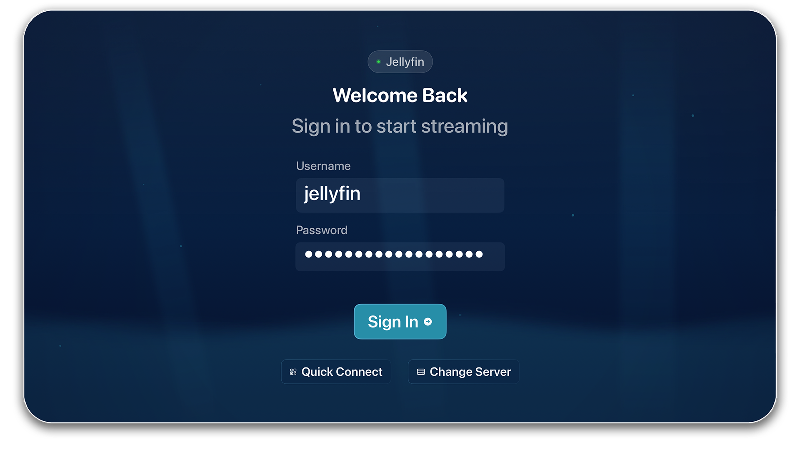
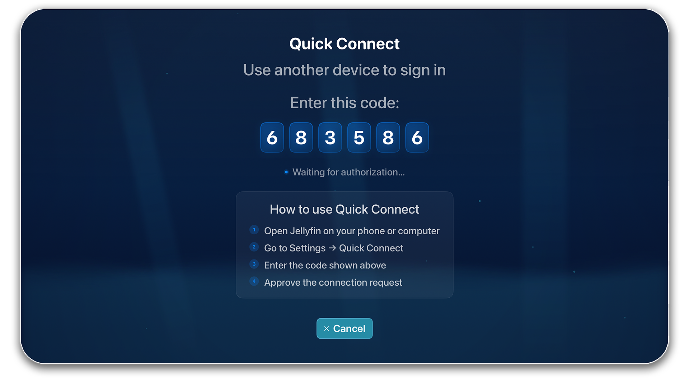

# Authentication

## Username & Password

1. Enter your Jellyfin username
2. Enter your password (leave blank if none)
3. Press **Sign In**

## Quick Connect

Follow the on-screen instructions to enter your Quick Connect auth code.
You will automatically sign in after the login has been authenticated.

**Note:** Quick Connect must be enabled on your server for this feature to work

## Session Storage

Neptune securely saves your session:

- Authentication tokens are stored in device Keychain
- Sessions persist across app restarts
- Quick profile switching without re-entering password

See [Profiles](/personalization/profiles) for managing multiple accounts.
