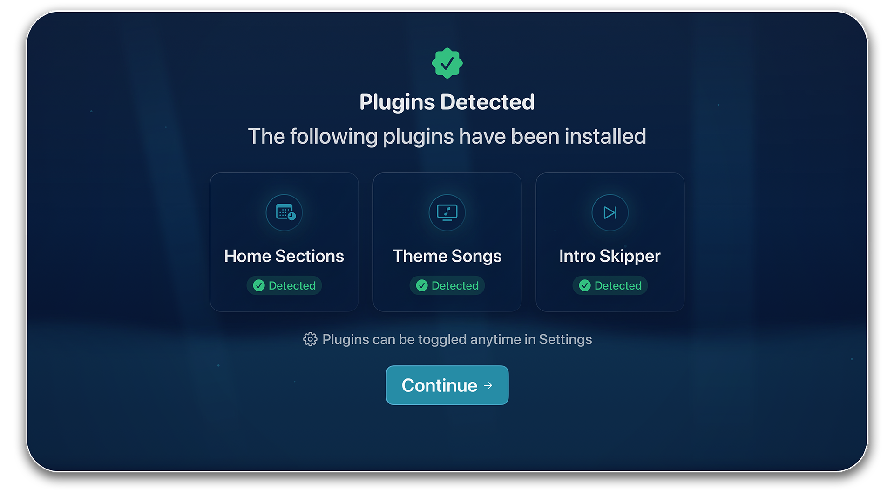

# Plugin Discovery

## Supported Plugins

| Plugin | Feature |
|--------|---------|
| **Home Sections** | Shows upcoming content and provides 'Because You Watched' recommendations |
| **Theme Songs** | Downloads theme music for TV series that play on their respective pages |
| **Intro Skipper** | Skip intros, credits, and recaps during playback |

## Detection Process

After signing in, Neptune will scan your server for a list of compatible plugins. When a plugin is detected, it will automatically be enabled in Neptune.

## No Plugins?

Neptune works great without plugins. You can install them later on your Jellyfin server - Neptune detects them automatically on your next session.

## Managing Plugins

You can manage installed plugins from **Settings** > **[Plugins](/settings/plugins)**. Here you can toggle them on or off and adjust various plugin specific options.
