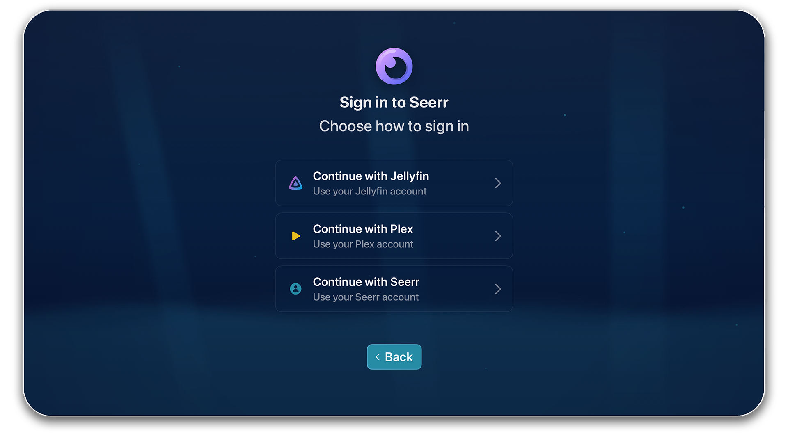

# Seerr Setup

## What is Seerr?

Seerr (formerly known as Jellyseerr) lets you:

- Browse trending and popular content
- Request movies and TV shows
- Track request status

You can read more about it on <a href="https://seerr.dev/" target="_blank">seerr.dev</a>

## Automatic Detection

Neptune tries to find Seerr automatically:

- **IP addresses:** Checks port 5055 (e.g., `192.168.1.100:5055`)
- **Domains:** Checks for `seerr` subdomain

If detected, it will try to login via Jellyfin automatically. If it's unable to, you can always  **login to Seerr** using your own athentication methods. 

## Manual Setup

**Subdomain setup:**

1. Select **Yes** when asked about subdomain hosting
2. Enter the subdomain name (e.g., `seerr`)
3. Press **Connect**

**Custom URL:**

1. Select **No, enter full URL**
2. Enter your complete Seerr address
3. Press **Connect**

## Signing In

Neptune allows you to sign-in to Seerr in various ways:

- Using your Seerr account
- Using your Jellyfin account
- Using your Plex account

Your session is then saved for future use, so you only have to login once

## Skipping Setup

Select **Skip for Now** if you don't have Seerr. You can configure it at any time via **Settings**.
