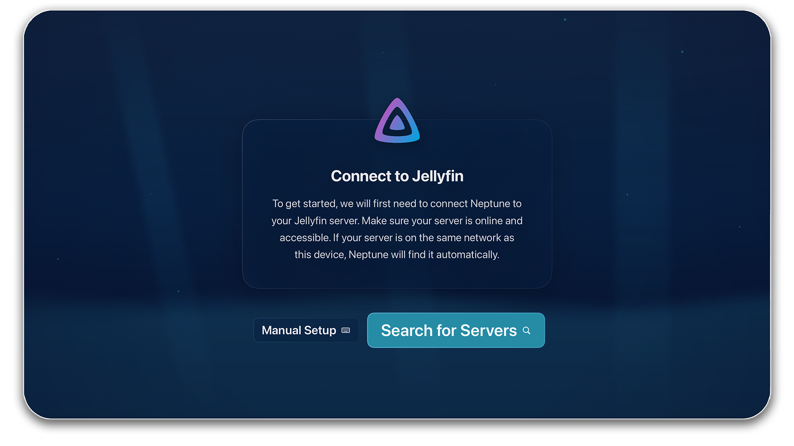
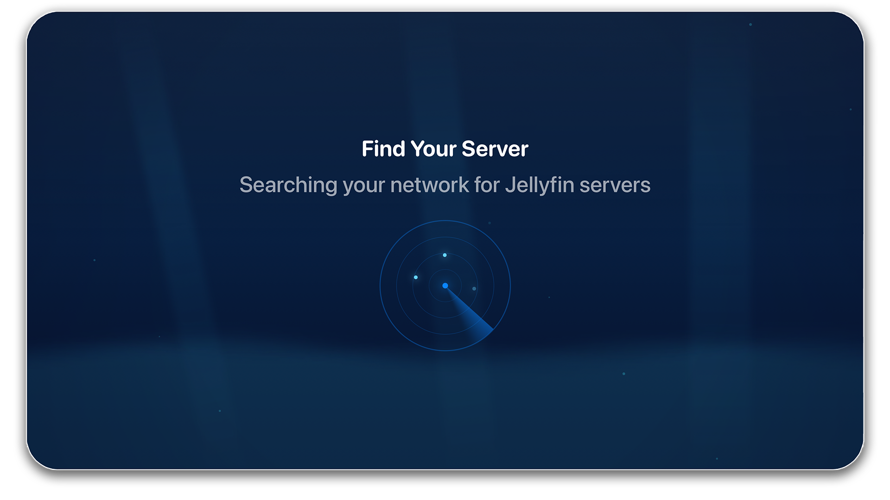
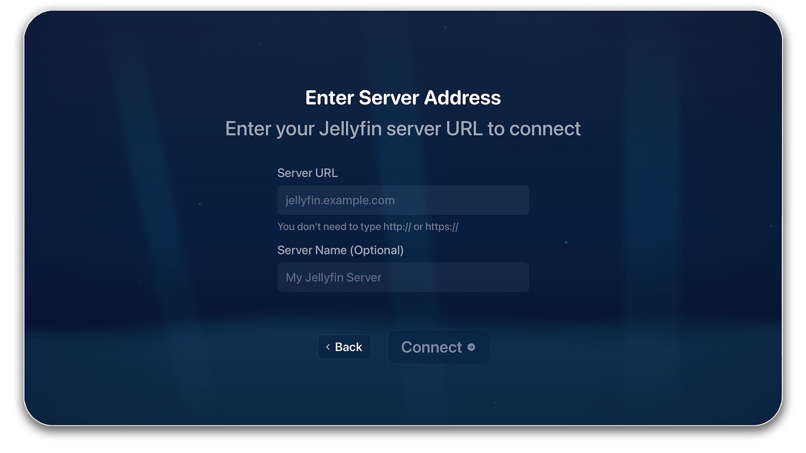

# Server Connection

## Auto-Discovery

Neptune automatically scans your local network for Jellyfin servers.

**Requirements:**

- Your client and your Jellyfin server have to be on the same network
- Network discovery needs to be enabled in Jellyfin

## Manual Setup

For remote servers or when auto-discovery doesn't find your server:

1. Select **Manual Setup**
2. Enter server address (e.g., `jellyfin.example.com` or `192.168.1.100:8096`)
3. Press **Connect**

## Troubleshooting

**No servers found:**

- Verify your Jellyfin server is running
- Ensure both devices are on the same network
- Try manual entry instead

**Connection fails:**

- Verify the server URL is correct
- Check firewall settings on your server
- Ensure the port is accessible
